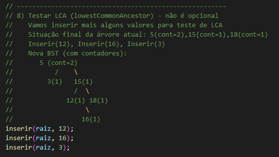
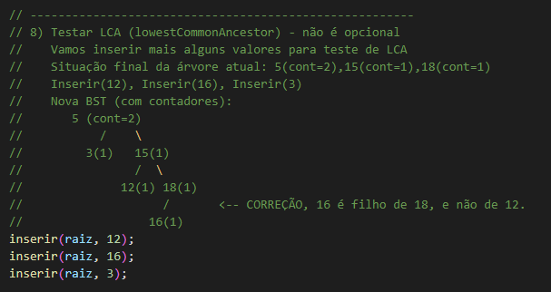

# Trabalho de Estruturas de Dados - UEL 2025
## Professor Anderson Ávila
## Autor: Alexandre Marchioli

### Descrição Geral
Este projeto implementa uma Árvore Binária de Busca (BST) em C. As funções necessárias estão implementadas e devidamente testadas na função `main()` fornecida pelo professor. O objetivo é manipular a estrutura da árvore e seus elementos através de diversas operações, como inserção, busca, remoção e outras.

### Funções Implementadas

#### 1. `inicializar(PONT* raiz)`
- Inicializa a árvore, deixando-a vazia.

#### 2. `criarNo(int valor)`
- Cria um novo nó com a chave dada.

#### 3. `buscar(PONT raiz, int valor)`
- Busca um nó na árvore com a chave dada.

#### 4. `inserir(PONT raiz, int valor)`
- Insere um novo nó na árvore ou incrementa o contador caso o nó já exista.

#### 5. `buscarNo(PONT raiz, int valor, PONT *pai)`
- Função auxiliar para buscar um nó e retornar seu pai.

#### 6. `removerUmaOcorrencia(PONT raiz, int valor)`
- Remove uma única ocorrência de um nó com a chave dada.

#### 7. `removerTodasOcorrencias(PONT raiz, int valor)`
- Remove todas as ocorrências de um nó com a chave dada.

#### 8. `exibirInOrder(PONT raiz)`
- Exibe os elementos da árvore na ordem simétrica.

#### 9. `exibirPreOrder(PONT raiz)`
- Exibe os elementos da árvore na ordem pré-fixada.

#### 10. `exibirPosOrder(PONT raiz)`
- Exibe os elementos da árvore na ordem pós-fixada.

#### 11. `contarNos(PONT raiz)`
- Conta o número de nós distintos na árvore.

#### 12. `contarTotalElementos(PONT raiz)`
- Conta o total de elementos na árvore, somando os contadores.

#### 13. `kEsimoMenor(PONT raiz, int k)`
- Encontra o k-ésimo menor elemento na árvore.

#### 14. `imprimirIntervalo(PONT raiz, int min, int max)`
- Imprime os elementos da árvore dentro de um intervalo de valores.

#### 15. `lowestCommonAncestor(PONT raiz, int val1, int val2)`
- Encontra o ancestral comum mais próximo dos nós com valores `val1` e `val2`.

### Função `main()`
A função `main()` é fornecida pelo professor para depuração e testes das funções implementadas. Ela executa uma série de operações de inserção, busca, remoção e contagem, verificando os resultados esperados e observados. Além disso, inclui testes extras de percurso (pré-ordem e pós-ordem), presentes no main().

### Explicação do Erro de Valor Esperado em `lowestCommonAncestor`
No teste do `lowestCommonAncestor` (LCA) para os valores 16 e 18, o comentário original do professor indicava que o LCA deveria ser 15. No entanto, com base na ordem de inserção e estrutura da árvore, o valor correto é 18. O valor 16 é filho de 18, e não de 12, conforme mencionado erroneamente no comentário. 

A explicação detalhada foi deixada no código e neste README para esclarecimento. Segue imagem de comparação de comentários:

### Comentário original

### Comentário corrigido

---

Alexandre Marchioli
